# Getting started with the ADT Sample App
Bear in mind as you get started: ::Azure Digital Twins is still in Private Preview::. We promise no SLA and anything can break at any point in time. Please report bugs and help us stabilize the service!

The major steps you'll need to do to get started are

0. Prerequisites
1. Create an instance and configure your application
2. Develop your solution

# 0. Pre-requisites

1. Have [Visual Studio 2019](https://visualstudio.microsoft.com/downloads/) pre-installed on your machine
    - **You MUST update to the latest version (16.5.1XXX as of writing this) or you will get Visual Studio errors**
    - To update, open the Visual Studio Installer  on your machine and complete the latest installation

2. Make sure you have the Azure CLI package installed on your computer
    - If you have it installed already, run `az --version` to make sure `azure-cli` is at least **version 2.0.8** -- if it isn't, use the link below to install the latest version
    - Use this link to install if you haven't: [Azure CLI Installation Documentation](https://docs.microsoft.com/en-us/cli/azure/install-azure-cli?view=azure-cli-latest])

3. Download the sample project
    - If you haven't already, download this entire repository. We recommend **downloading as a ZIP file** for an easier experience
4. Install Azure IoT CLI Extension
ADT's CLI commands are not standard in the Azure CLI package yet, so you must first download the latest extension.
    - Download the [latest snapshot](https://github.com/Azure/azure-digital-twins/tree/private-preview/CLI) of the ADT enabled IoT CLI extension (a .whl file). 
  
    - Open ::Windows Powershell:: at the location you downloaded the extension to
    - Run `az extension list`. If you have `azure-iot` or `azure-cli-iot-ext` installed, remove both with `az extension remove --name azure-iot` (current alias) and `az extension remove --name azure-cli-iot-ext` (legacy alias)

    - Add the new extension with `az extension add -y --source <whl-filename>`
    - See the top-level ADT commands with `az dt -h`
5. Configure AAD app registration and save important strings
    - [Optional] If you don't have an app registration for ADT, follow guidance in [How to authenticate - create an app registration](https://github.com/Azure/azure-digital-twins/blob/private-preview/Documentation/how-to-authenticate.md) (screenshot from the process below)
                
    - [Required] Once created, use ::[Azure Portal - AAD app registrations](https://portal.azure.com/#blade/Microsoft_AAD_IAM/ActiveDirectoryMenuBlade/RegisteredApps):: to navigate to the app registration overview page and make note of the *Application ID* and *Directory ID*
        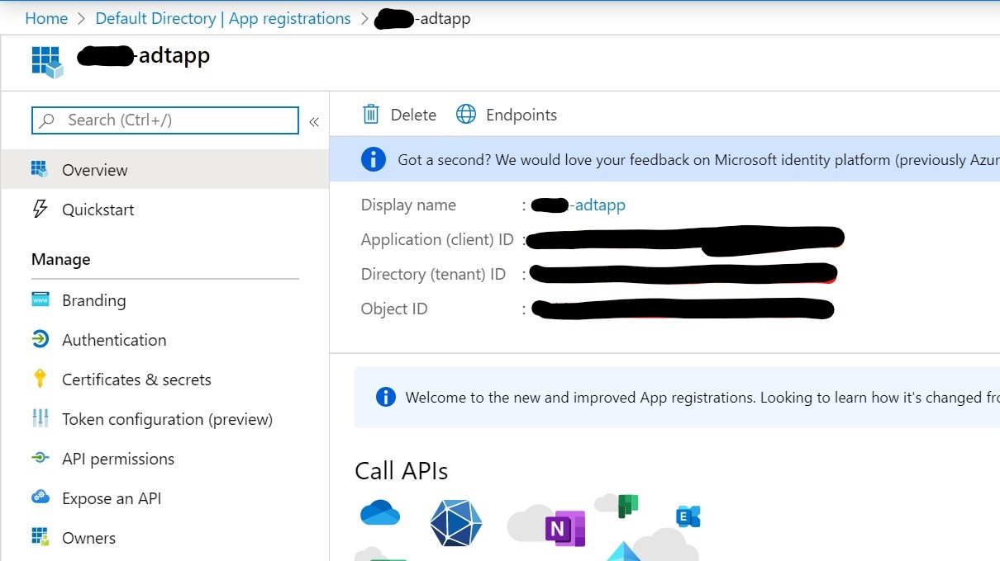

<div style='background: #82CFFD; padding: 10px 15px; color:black;'>
  Save<b> &lt;your-ClientId&gt; </b>(<i>Application ID</i>) and <b> &lt;your-TenantId&gt; </b>(<i>Directory ID</i>) from above and <b> &lt;your-subscription&gt; </b> (<i>your ADT Private Preview allow-listed subscription ID</i>) in <i>SavedStrings.txt</i>, stored adjacent to this readme file. The text file will help you keep track of important strings throughout this sample.
</div>


6. [Optional] Check out the ADT Swagger to learn about our APIs
    - Download and install the [Swagger Viewer VS Code extension](https://marketplace.visualstudio.com/items?itemName=Arjun.swagger-viewer)
    - Navigate back a directory in the repo and to *OpenApiSpec > * **digitaltwins.json**, right-click it and open with Visual Studio Code
    - Press *F1* and enter the command "Preview Swagger"
    - The compiled swagger should appear adjacent to the .json file


# Create an instance and configure your solution
## 1. Create an ADT instance
These instructions use the recommended ADT CLI commands (az dt) to _set the context to your subscription_, _create a resource group_ and _create an ADT instance_. Complete these steps using ::Windows Powershell:: on your machine. Anything <in-brackets> is your own resources that you need to replace.

> This document encourages ::Windows Powershell:: due to its parsing of quotations. Alternative bashes will work for most commands, but may fail on commands with *single-quote* and/or *double-quote* characters.

<div style='background: #5fff3b; padding: 10px 15px; color:black;'>
  Make sure to sign in with the AAD account associated with your subscription! 
</div>

Login and set the context to your allow-listed subscription
```
az login
az account set --subscription <your-subscription-id>
```
> Ensure your subscription is allow-listed with the ADT Private Preview or else you will not be able to access ADT APIs

Register with the Azure Digital Twins namespace, create a resource group and create your ADT instance
```
az provider register --namespace 'Microsoft.DigitalTwins'
```
> If using cmd or bash, you may have to remove the quotes or use double-quotes for `Microsoft.DigitalTwins`
```
az group create --location "westcentralus" --name <your-resource-group>
az dt create --dt-name <your-adt-instance> -g <your-resource-group>
az dt show --dt-name <your-adt-instance>
```
<div style='background: #82CFFD; padding: 10px 15px; color:black;'>
  Save <b> &lt;your-resource-group&gt;</b>, <b> &lt;your-adt-instance&gt; </b> and <b> &lt;your-adt-instance-hostName&gt; </b> (from the output of the <i>create</i> operation) from above in <i>SavedStrings.txt</i> at the root of the repo. You will use them later
</div>

## 2.  Assign an AAD role
ADT uses AAD for RBAC, so you must create a role assignment for your tenant to be able to make data plane calls to your instance.

Create the role assignment using the AAD email associated with your tenant (*\<your-AAD-email>*)
```
az dt rbac assign-role --dt-name <your-adt-instance> --assignee "<your-AAD-email>" --role owner
```

> If you get a *400: BadRequest* error, navigate to your user in the [AAD Users page](https://portal.azure.com/#blade/Microsoft_AAD_IAM/UsersManagementMenuBlade/AllUsers) and use the **Object ID** instead of *\<your-AAD-email>*
> 
> 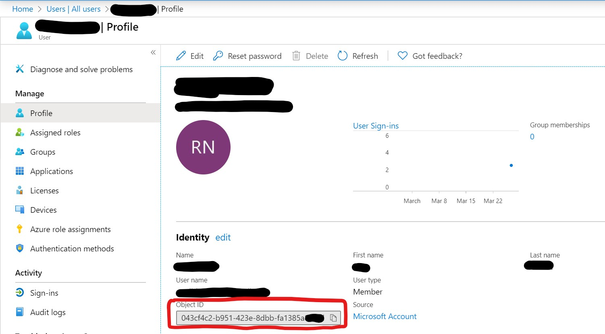


## 3.  Open the sample app
ADT has put together a sample app to make it easier for people to start testing the service. This app implements…
- Device authentication 
- Already-generated autorest SDK
- Sample usage of the SDK (in _CommandLoop.cs_)
- Console interface to call the ADT API
- _BuildingScenario_ - a sample ADT solution
- _HubtToDT_ - a Functions App to update your ADT graph as a result of telemetry from IoT Hub
- _DTRoutedData_ - a Functions App to update your ADT graph as a result of ADT-routed data 

To get started with this app on your local machine…
  
Launch *DigitalTwinsMetadata >* **DigitalTwinsSample.sln** and edit the following values

In *DigitalTwinsMetadata > DigitalTwinsSample > **Program.cs**, change `adtInstanceUrl` to your ADT instance hostname, `ClientId` to *\<your-ClientId>* and  `TenantId` to *\<your-TenantId>*
```
private const string ClientId = "<your-ClientId>";
private const string TenantId = "<your-TenantId>";
const string AdtInstanceUrl = "https://<your-adt-instance-hostname>"
```

## 4.  Start testing!
There are tons of sample code in **CommandLoop.cs** and **BuildingScenario.cs**, go play around 😊 When you feel comfortable with this code, go try building your own solution! There are infinite physical environments to model with Digital Twins, try a couple yourself.

- To start testing, jump to **Develop your solution**

* * *
# Feedback and issue tracking
Throughout the ADT Private Preview, if you 
* Run into issues
* Have feature requests
* Want clarification on a feature
* Have general comments or questions

Reach out to your assigned Private Preview PM! If you're confused about who that is, ask any ADT contact and they'll be able to route you correctly.
* * *

# Develop your solution
For your inspiration, we have an introduction to ADT commands and steps to develop a Digital Twins solution. **E2E building scenario** is a walk-through of a real-world building application using ADT. You'll create the following workflow that automates sensors in the building like this:


 |   *E2E building scenario*                            |
|------------------------------------------------|
|    0. ADT Basics                                |
 | 1. Instantiate building scenario                 |
| 2. Send simulated telemetry from IoT Hub |
 |   3.   Set up an event handling Functions App         |

1. *(optional)* Familiarize yourself with how to create models/relationships/query - *not required for the following steps*
2. Instantiate metadata for the building scenario (create models, create your graph with twins as devices, rooms and floors) 
3. Route simulated device telemetry from IoT Hub to a Functions App to update properties in an ADT instance
4. Process notifications from DT via endpoints and routes and aggregate data on floor level (again, reformulate to sound good)

When you run the sample project, there will be interactive Authorization that runs. It's mainly automated, all you need to do is **choose your account when it prompts you in the browser**!
<div style='background: #5fff3b; padding: 10px 15px; color:black;'>
  Make sure to sign in with the AAD account associated with your subscription! 
</div>

> If Visual Studio throws a .NET error, check out the **Visual Studio error when the project is run** topic in **Troubleshooting** (at the end of this file)
## 0. (a) Model a physical environment with DTDL
### Context
Interfaces are the bread and butter of Digital Twins. They're very similar to classes in C# -- they're the skeleton of Twins (nodes in the graph). They're written in DTDL and have a structure like this Hospital. 
```
{
  "@id": "urn:example:Hospital:1",
  "@type": "Interface",
  "name": "Hospital",
  "contents": [
    {
      "@type": "Property",
      "name": "VisitorCount",
      "schema": "double"
    },
    {
      "@type": "Property",
      "name": "HandWashPercentage",
      "schema": "double"
    },
    {
      "@type": "Relationship",
      "name": "managedWards",
      "target": "*"
    }
  ],
  "@context": "http://azure.com/v3/contexts/Model.json"
}

```

> Check out sample models in */DigitalTwinsMetadata/DigitalTwinsSample/Models*

### How to test
1. Once you've checked out the sample models (and maybe even created your own!), start () the **DigitalTwinsSample** project. A console will pop up, device authentication will happen and some options are presented. 
2. Upload the models for Floor and Room.
 ```
 addModels Floor Room
 ```
> Notice Floor.json and Room.json are in the */DigitalTwinsMetadata/DigitalTwinsSample/Models* folder

You can verify they were created with the `listModels` command. 

### Variations
You'll notice that `addModels` is actually just calling _CommandLoop.SubmitAddModels_. Read the [DTDL technical deep dive](https://github.com/Azure/azure-digital-twins/blob/private-preview/Documentation/Digital%20Twins%20Definition%20Language%2C%20Version%202%2C%20Draft%202%2C%20NDA.pdf), twin types [concepts documentation](https://github.com/Azure/azure-digital-twins/blob/private-preview/Documentation/concepts-twin-types.md) and [how-to documentation](https://github.com/Azure/azure-digital-twins/blob/private-preview/Documentation/how-to-manage-twin-type.md), then try these variations.
- Create your own models
  - In the */DigitalTwinsMetadata/DigitalTwinsSample/Models* folder and upload them
- Update models
  - Edit **Floor.json** or **Room.json**, change the** @id** to `urn:example:<model-name>:2`
     - The 2 is the updated version number. Any number greater than the current version number works!
  - Edit by adding Properties or Relationships
- Try adding Inheritance to your models

## 0. (b)  Create your graph with twins and relationships
### Context
Now that you have some models uploaded, you can create instances of those models which we've named "twins." Twins constitute the digital graph of your business environment, whether it's sensors on a farm, rooms in a building or lights in your car.

To create a twin, you must reference the model urn that the twin should relate to and define values for any properties in the model.  
### How to test
1. Create twins using the Floor and Room models

Notice that Room has two properties and thus must accept initial values as arguments

```
addTwin urn:example:Floor:1 floor0
addTwin urn:example:Room:1 room0 Temperature double 100 Humidity double 60
addTwin urn:example:Room:1 room1 Temperature double 200 Humidity double 30
```
1. Query your graph to verify the twins were created
   - Notice `queryTwins` allows you to input SQL-like queries as an argument, but leaving it blank executes a _SELECT * FROM DIGITALTWINS_ query.
 
`queryTwins`

1. Add a "contains" edge from the Floor twin to each of the Room twins
```
addEdge floor0 contains room0 edge0
addEdge floor0 contains room1 edge1
```
2. Verify the edges were created, either of the following ways.
```
listEdges floor0
```
or
```
getEdgeById floor0 contains edge0
getEdgeById floor0 contains edge1
```
You've created the following graph.


### Variations
Read the [twin graph concept documentation](https://github.com/Azure/azure-digital-twins/blob/private-preview/Documentation/concepts-twins-graph.md), [twin management how-to documentation](https://github.com/Azure/azure-digital-twins/blob/private-preview/Documentation/how-to-manage-twin.md) and [twin graph management how-to documentation](https://github.com/Azure/azure-digital-twins/blob/private-preview/Documentation/how-to-manage-graph.md), then try out these variations.

- Try deleting edges and twins 
   - To delete a twin using `deleteTwin`, you have to first delete the edges using `deleteEdge`
- Model any physical space (your apartment, a car, a hospital… anything!) 
   - Create your own models in */DigitalTwinsMetadata/DigitalTwinsSample/Models*, then use `uploadModel`, `createTwin`, and `addEdge` to create your graph

## 0. (c)  Query your graph
### Context
A large value prop for ADT is being able to query your graph easily and efficiently. With this querying, you can answer questions such as…
1. Which twins have a Temperature property with a value of 200?
2. Which twins are created from the Floor model?
3. Which twins are contained in the Floor twin?

### How to test
1. Query based on the Temperature property

`queryTwins SELECT * FROM DigitalTwins T WHERE T.Temperature = 200 `

2. Query based on the model urn

`queryTwins SELECT * FROM DIGITALTWINS T WHERE IS_OF_MODEL(T, 'urn:example:Floor:1')`

3. Query based on relationships (replace floor-twin-id with the $dtId for the Floor twin)

`queryTwins SELECT room FROM DIGITALTWINS floor JOIN room RELATED floor.contains where floor.$dtId = 'floor1'`

### Variations
Read the [query language documentation](https://github.com/Azure/azure-digital-twins/blob/private-preview/Documentation/concepts-query-language.md) and [graph query how-to documentation](https://github.com/Azure/azure-digital-twins/blob/private-preview/Documentation/how-to-query-graph.md), then try these variations.

- Combine the above queries as you would with SQL 
   - Use combination operators such as AND, OR, NOT
- Test conditionals for properties 
   - Use IN, NOT IN, STARTSWITH, ENDSWITH, =, !=, <, > <=, >=

* * *
Now that you've done all the ADT basics, let's dive into a real scenario. We're going to
- Create a graph in your ADT instance that models a building with a Floor, a Room and a Thermostat
- Simulate telemetry through IoT Hub to update the graph
- Deploy a Functions App that updates the Room model when the Thermostat model is updated

The image below indicates the entire pipeline that you're about to build.


## 1.  Instantiate the building scenario
In this step, you'll be creating this section of the pipeline
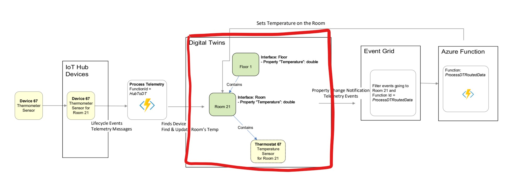

Start () the *DigitalTwinsSample* project in ::Visual Studio::. In the console that pops up, run the following command.
**NOTE:** This command will delete the twins in your instance and create a sample ADT solution!
```
buildingScenario
```
Twins have been deleted and new twins have been created. You can run the following command to see the new twins.
```
queryTwins
```

## 2.  Send simulated telemetry from IoT Hub
The next step, to bring your Digital Twins instance alive, is to simulate device telemetry from IoT Hub trigger an update to the ADT graph. You'll be completing this section of the pipeline
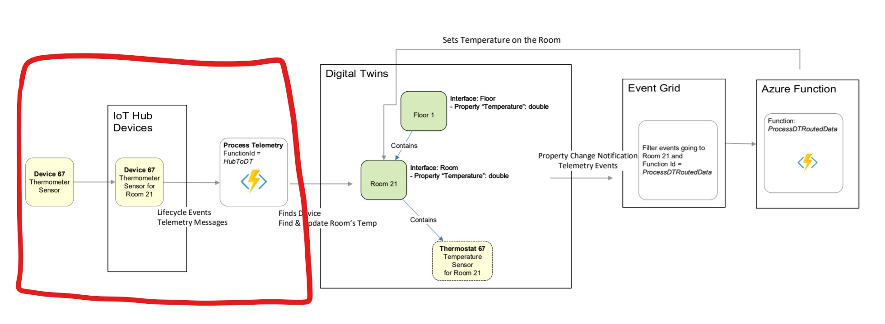

This step takes some time because you have to set up Azure resources and create connections. You will:
> - Deploy a pre-made Functions App
> - Assign an AAD Identity to the Function App
> - Create an IoT Hub
> - Create an event subscription from IoT Hub to the Functions App
> - Create a device in IoT Hub
> - Simulate the device telemetry using the *DeviceSimulator* project
> - See the LIVE results in the *DigitalTwinsSample* project

### 1.    Go to the *DigitalTwinsSample* project in ::Visual Studio::
Navigate to *DigitalTwinsMetadata > DigitalTwinsSample > HubToDT >* **ProcessHubToDTEvents.cs**,  change `AdtInstanceUrl` to your ADT instance hostname
```
const string AdtInstanceUrl = "https://<your-adt-instance-hostname>"
```
In the Solution Explorer, right click the **HubToDT project file** and click **Publish**
 

Select **Create Profile**


- Change the **Name** to a new value, *\<your-HubToDT-function>*
- Change the **Subscription** to *DigitalTwins-Dev-Test-26*
- Change the **Resource group** to *\<your-resource-group>*
- Create a new storage resource using the **New...** link

- Create a storage account with a new name (*\<your-storage-account>*) in the window that pops up and select **OK**

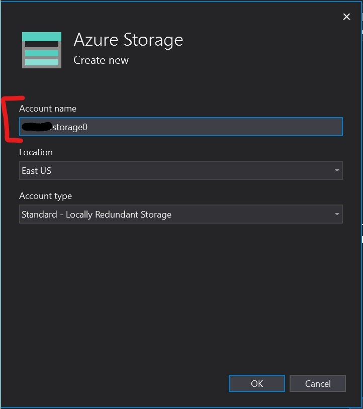
<div style='background: #82CFFD; padding: 10px 15px; color:black;'>
  Save <b> &lt;your-HubtToDT-function&gt; </b> and <b> &lt;your-storage-account&gt; </b> from above in <i>SavedStrings.txt</i> at the root of the repo. You will use them later
</div>

- Select **Create** in the "App Service Create new" window
- Select **Publish** on the tab the opens in VS
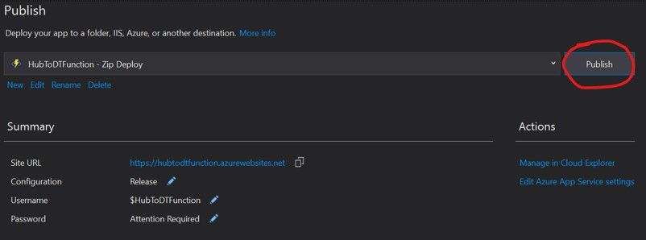

You may see a popup like this, just select **Attempt to retrieve credentials from Azure** and **Save**
 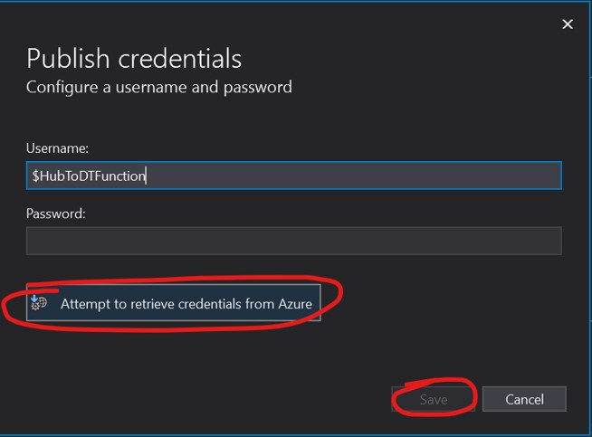
 
> If your Functions App doesn't deploy correctly, check out the **Publishing the Functions App isn't working** topic in **Troubleshooting** (at the end of this file)

### 2. Assign system-managed AAD identity to your function app on ::Windows Powershell::. 
Enable the system-managed identity and get the *principalId* field.
```
az functionapp identity assign -g <your-resource-group> -n <your-HubToDT-function>
```
Use the *principalId* value from the response above to create the AAD role
```
az dt rbac assign-role --assignee <principalId-value> --dt-name <your-adt-instance> --role owner
```
### 3. Create your IoT Hub instance
```
az login
az account set --subscription <your-subscription-id>
az iot hub create --name <your-iothub> -g <your-resource-group> --sku S1
```
<div style='background: #82CFFD; padding: 10px 15px; color:black;'>
  Save <b> &lt;your-iothub&gt; </b>  from above in <i>SavedStrings.txt</i> at the root of the repo. You will use it later
</div>

### 4. Create an Event Subscription on your IoT Hub with the Functions App as an endpoint in ::[Azure Portal](https://ms.portal.azure.com/#home)::

Navigate to your recently created IoT Hub, select the *Events* blade and select *+ Event Subscription*
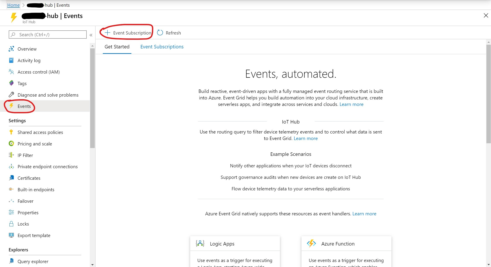

- **Name**: *\<your-event-subscription>*
- **Filter Event Types**: *make selections like this*
- [ ] Device Created
- [ ] Device Deleted
- [ ] Device Connected
- [ ] Device Disconnected
- [x] Device Telemetry
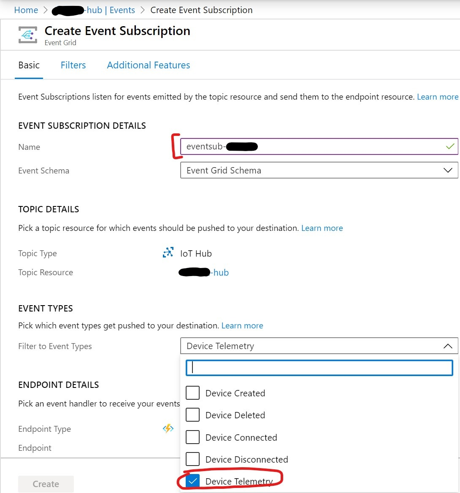

- Select the **Select an endpoint** link
- Fill out form based on your **Subscription**, **Resource group**, **Function app** and **Function** (it should auto-populate after selecting the subscription)
- Select **Confirm Selection**
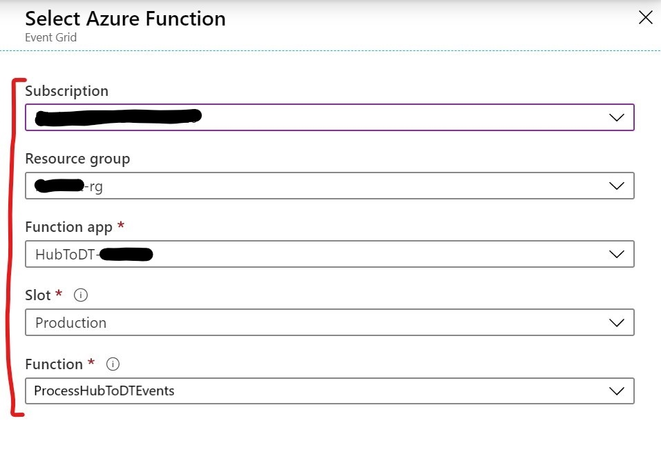
### 5. Create a device in IoT Hub with the ID *thermostat67* in ::Windows Powershell::
```
az iot hub device-identity create --device-id thermostat67 --hub-name <your-iothub> -g <your-resource-group>
```
> Note: IoT Hub device creation can be done in your solution, too. Refer to the sample in *DeviceSimulator > Program*, **CreateDeviceIdentity()**
### 6. Set up the device simulator to send data to your IoT Hub instance
Get the *hub connection-string* 
```
az iot hub show-connection-string -n <your-iothub>
```
 Get the *device connection-string* 
```
az iot hub device-identity show-connection-string --device-id thermostat67 --hub-name <your-iothub>
```
Launch Device Simulator > **DeviceSimulator.sln** in ::Visual Studio:: and change the following values in *DeviceSimulator >  DeviceSimulator >* **AzureIoTHub.cs** with the value you got above
```
connectionString = <hub connection-string>
deviceConnectionString = <device connection-string>
```
### 7. Start the simulation and see the results! 

Start () the **DeviceSimulator** project in ::Visual Studio::.

The following console should pop up with messages being sent. You won't need to do anything with this console.


Start () the **DigitalTwinsSample** project in ::Visual Studio::

Run the following command in the new console that pops up.
```
cycleGetTwinById thermostat67
```
You should see the 🌴 LIVE 🌲 updated temperatures 🌡 *from your ADT instance* being logged to the console every 10 seconds!!
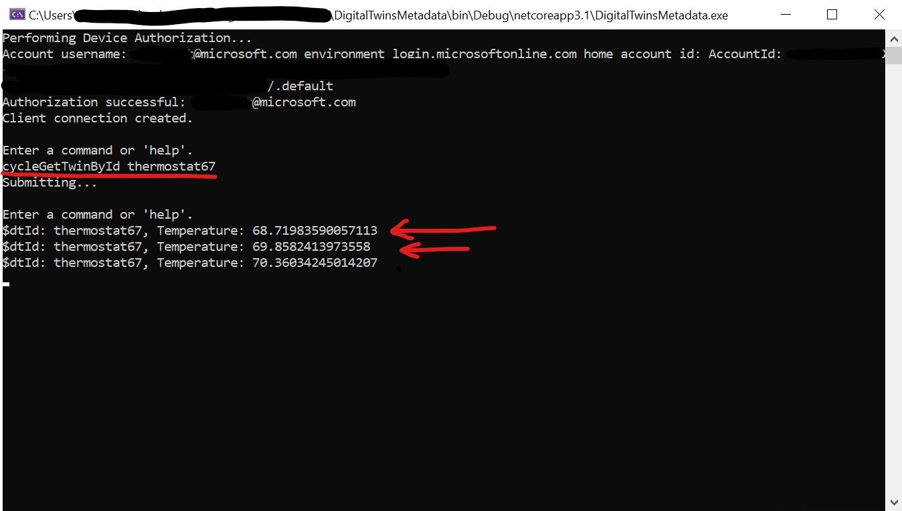

## 3. Set up an event handling Functions App
Welcome to the final step of our Building Scenario! You'll be completing this section of the pipeline:

This step involves 
> - Creating an ADT endpoint to Event Grid
> - Setting up a route within ADT to send property change events to the ADT endpoint
> - Deploying a Functions App

### 1. Create an event grid topic, ADT endpoint and ADT route
Submit the following command in ::Windows Powershell:: to create the event grid topic
```
az eventgrid topic create -g <your-resource-group> --name <your-event-grid-topic> -l westcentralus
```
Create your ADT endpoint (`<your-adt-endpoint>`) pointing to your Event Grid topic, filling in the fields for your resource names and resource group
```
az dt endpoints add eventgrid --dt-name <your-adt-instance> --eventgrid-resource-group <your-resource-group> --eventgrid-topic <your-event-grid-topic> --endpoint-name <your-adt-endpoint>
```
Verify the "privisioningState" is "Succeeded"
```
az dt endpoints show --dt-name <your-adt-instance> --endpoint-name <your-adt-endpoint> 
```
<div style='background: #82CFFD; padding: 10px 15px; color:black;'>
  Save <b> &lt;your-event-grid-topic&gt; </b> and <b> &lt;your-adt-endpoint&gt; </b> from above in <i>SavedStrings.txt</i> at the root of the repo. You will use them later
</div>

Create an ADT route (`<your-adt-route>`) pointing to your ADT endpoint (`<your-adt-endpoint>`), filling in the fields for your resource names and resource group
```
az dt routes add --dt-name <your-adt-instance> --endpoint-name <your-adt-endpoint> --route-name <your-adt-route>
```

### 2. Deploy DTRoutedData Functions App
This Functions App is fired when events are emitted in ADT - it  updates the _Temperature_ field on the _Room_ twin.

Open the **DigitalTwinsSample** solution in ::Visual Studio::. 

Navigate to *DTRoutedData >* **ProcessDTRoutedData.cs**, change `adtInstanceUrl` to your ADT instance hostname
```
const string AdtInstanceUrl = "https://<your-adt-instance-hostname>"
```

Right-click the *ProcessDTRoutedData* project file in the **Solution Exporer** and select **Publish**


Select **Create profile**
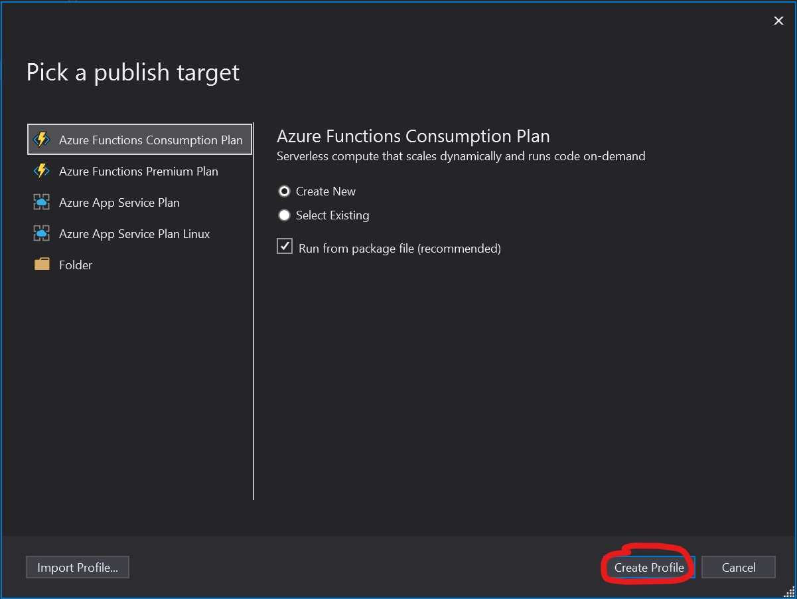

* Fill in a new **Name** for the Functions App (*\<your-DTRoutedData-function>*) 
* **Subscription**: *DigitalTwins-Dev-Test-26*
* **Resource Group**: *\<your-resource-group>*
* **Azure Storage**: *\<your-azure-storage>


Select **Publish**


> If your Functions App doesn't deploy correctly, check out the **Publishing the Functions App isn't working** topic in **Troubleshooting** (at the end of this file)

### 3. Create an event grid subscription from your event grid topic to your *ProcessDTRoutedData* Azure Function
In ::[Azure Portal - event grid topics](https://portal.azure.com/#blade/HubsExtension/BrowseResource/resourceType/Microsoft.EventGrid%2Ftopics)::, navigate to your event grid topic (*\<your-event-grid-topic>*) and select **+ Event Subscription**
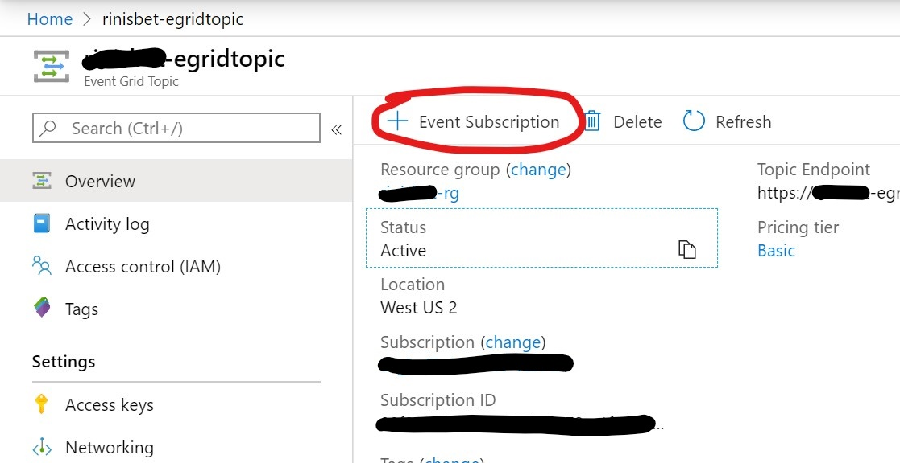

Choose a new name for your Event grid subscription (*\<your-event-grid-subscription>*), select *Azure Function* for the **Event type** and select **Select an endpoint**
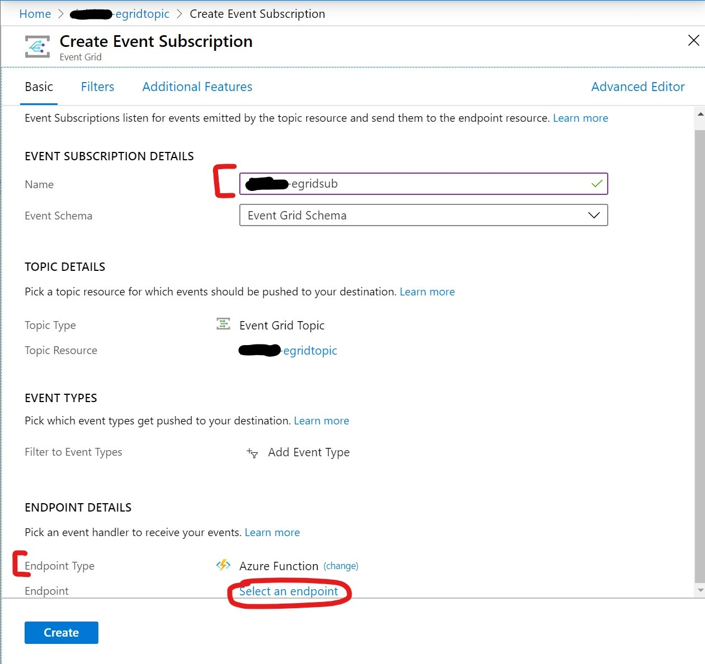

In the pane that appears, the fields should auto-populate. If not, fill in the field based on the function you just deployed
- **Subscription**: *\<your-subscription-id>*
- **Resource group** *\<your-resource-group>*
- **Function app** (*\<your-DTRoutedData-function>*
- **Function**: *ProcessDTRoutedData* 


Finally, select **Create** on the "Create Event Subscription" page.

### 4. Start the simulation and see the results! 

Start () the **DeviceSimulator** project in ::Visual Studio::.

The following console should pop up with messages being sent. You won't need to do anything with this console.


Start () the **DigitalTwinsSample** project in ::Visual Studio::

Run the following command in the new console that pops up.
```
cycleGetTwinById thermostat67 room21
```
You should see the 🌴 LIVE 🌲 updated temperatures 🌡 *from your ADT instance*. You'll notice you have both **thermostat67** and **room21** temperatures being updated.


## You've completed this sample
Here's a short review of what's happening.
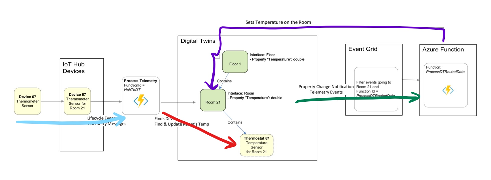

1. Your simulated events enter IoT Hub, are routed through event grid and trigger the *HubToDT* Azure Function (represented by the light blue line)
2. Your *HubToDT* Azure Function calls the ADT API that sets a property on *thermostat67* (represented by the red line)
3. A "Property Change event" is routed to the event grid topic endpoint and the event grid subscription triggers the *ProcessDTRoutedData* Azure Function, represented by the green line
4. Your *ProcessDTRoutedData* Azure Function calls an ADT API that sets a property on *room21* (represented by the purple line)

# Troubleshooting
Commons issues that we've seen

### Publishing the Functions App isn't working.
We've seen that when users publish the HubToDT or DTRoutedData Functions App, the Function App publishes but the Function isn't available.
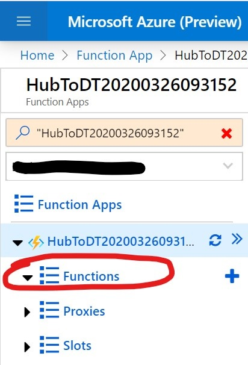
1. Make sure you've changed the `AdtInstanceUrl` value in *DigitalTwinsMetadata > DigitalTwinsSample > HubToDT > ProcessHubToDTEvents* or *DigitalTwinsMetadata > DigitalTwinsSample > DTRoutedData > ProcessDTRoutedData* correctly before publishing
2. Delete your Publish Profiles for the Functions App and re-publish
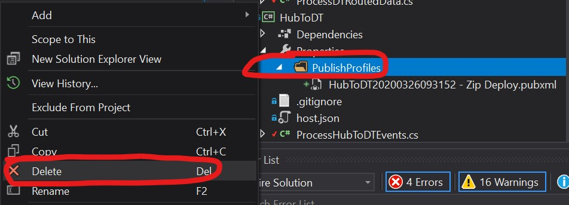

### Visual Studio error when the project is run.
Some users get this error when running the project. This is usually due to Visual Studio 2019 being out-of-date.

1. Update VS2019 to the latest version (16.5.1... as this is written)
2. Check out [this article](https://social.msdn.microsoft.com/Forums/sqlserver/en-US/b5e60c0b-dcd1-49ae-b86a-9fd9dfe65b5a/the-target-process-exited-warning-popup-in-vs-2019) if you want to read more

### Swagger is out of date.
The swagger will be updated throughout the Private Preview. This sample app should be updated by the ADT team, but here is guidance in case it is not.
1. Install autorest
```
npm install -g autorest@2.0.4413 
```
2. Navigate to *DigitalTwinsMetadata > ADTApi >* in ::Windows Powershell:: and replace the `digitaltwins.json` file with the updated swagger (latest swagger can be found [here in the github repo](https://github.com/Azure/azure-digital-twins/tree/private-preview/OpenApiSpec)). Run this command
```
autorest --input-file=digitaltwins.json --csharp --output-folder=ADTApi --add-credentials –azure-arm --namespace=ADTApi 
```
3. Delete the C# files and */Models* folder in *DigitalTwinsMetadata > ADTApi* and copy in the output of your `autorest` command (contents of *DigitalTwinsMetadata > ADTApi > ADTApi*)


:)
