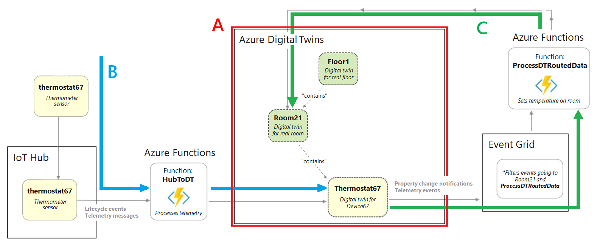

# Azure Digital Twins

Azure Digital Twins is a developer platform for next-generation IoT solutions that lets you create, run, and manage digital representations of your business environment, securely and efficiently in the cloud. With Azure Digital Twins, creating live operational state representations is quick and cost-effective, and digital representations stay current with real-time data from IoT and other data sources.

For more information about Azure Digital Twins and its key concepts, see the [Azure Digital Twins documentation](https://docs.microsoft.com/azure/digital-twins/).

## Sample project contents

This sample contains two code projects that can be used to set up and simulate a full end-to-end scenario that makes use of Azure Digital Twins.

The scenario components and data flow reflect this diagram:

The sample repo contains:

| File/folder | Description |
| --- | --- |
| `AdtSampleApp` | Contains a sample client application built to interact with Azure Digital Twins, as well as an Azure Functions app with two functions (*ProcessDTRoutedData* and *ProcessHubToDTEvents*) that are used to route data between Azure Digital Twins and other external services. |
| `DeviceSimulator` | Simulator for a that generates telemetry events. The simulated device is a thermostat that sends temperature telemetry every ~5 seconds. |
| `SavedStrings.txt` | Text file template that can optionally be used to hold key strings as a user works through the sample. |

## Instructions

There are two possible sets of instructions for working with this sample. Both are part of the [Azure Digital Twins documentation](https://docs.microsoft.com/azure/digital-twins/).
* [Quickstart: Get started with Azure Digital Twins](https://docs.microsoft.com/azure/digital-twins/quickstart)
* [Tutorial: Build an end-to-end solution](https://docs.microsoft.com/azure/digital-twins/tutorial-end-to-end)
